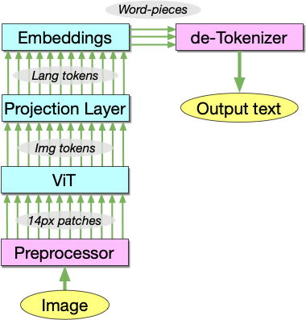

# How a VLM works

Visual Language Models (VLM's) use a pretrained LLM for their core smarts, but are adapted to be able to take images as inputs.  There are many variations on how to do this, but nowadays they've settled into a standard pattern which is fairly straightforward, depicted below.  
Images are first preprocessed into a set of image patches, often 14x14 pixel square (although of course other sizes are possible), and then these patches are each converted (linearly projected) into a vector space.  So now we have a single high-dimensional vector for each 14x14 pixel patch of the input image, and we'll typically have hundreds of these image patch vectors.
The image patch vectors are then sent through a neural network that is pre-trained for image analysis - typically a ViT (Vision Transformer) like CLIP.  

After the ViT's processing, these tokens are still in the vector space of the ViT, which has nothing to do with the word token space of the LLM.  For CLIP, these vectors are 768-dimensional.  But an LLM like Vicuna uses 4096-dimensional vectors.  So the most important part of the VLM is the projection layer which converts the image patch vectors into the word token space of the LLM.


In many VLM's this projection layer is very simple (linear, or a small MLP), acting on each token individually - meaning the number of tokens going into the LLM is the same as the number of patches in the image.  Some designs (like BLIP) use a more complex projection layer, which outputs a smaller number of language tokens - effectively learning a "summary" of the image, but the current trend in the research literature seems to be using simple projection layers, and putting the smarts in the LLM.

# What is the VLM saying about your image?

This tool allows you to see what a VLM is saying about your image.  It's a simple way to see what the VLM is "seeing" in your image, and to get a sense of what it's "thinking" about your image.  It does this by short-circuiting the entire LLM.  Once the projection layer is done, we have vectors in the language space.  The output stage of the VLM takes such vectors, and turns them back into words.  This tool does something quite similar, by taking the language tokens for each image patch, and converts them back to text, and overlays them on the image for you to see.



# Try it yourself

## Run it in Google Colab

Warning - this will take a **solid 5 minutes** to load before you can use it.

[](https://colab.research.google.com/github/pifanpi/visualizing-vlm-tokens/blob/main/run-in-colab.ipynb)

## Run directly on your own GPU machine

Either from the command line:

```
./install-requirements.sh
./imgtokens.py "https://www.mcgawgraphics.com/cdn/shop/products/O360PF_1024x1024.jpg?v=1662584163"
```

Or you can see more than one word per token, and change the output size like:

```
./imgtokens.py "https://i0.wp.com/champagnecoloredglasses.com/wp-content/uploads/2017/06/IMGP3124.jpg?resize=2000%2C1335&ssl=1" --num-words=2 --size=1500
```

Or running the [notebook](Visual-image-tokens.ipynb).


## Run inside Docker

```
docker build -t vlm-token-visualizer .
docker run -p 8000:8000 vlm-token-visualizer
```
